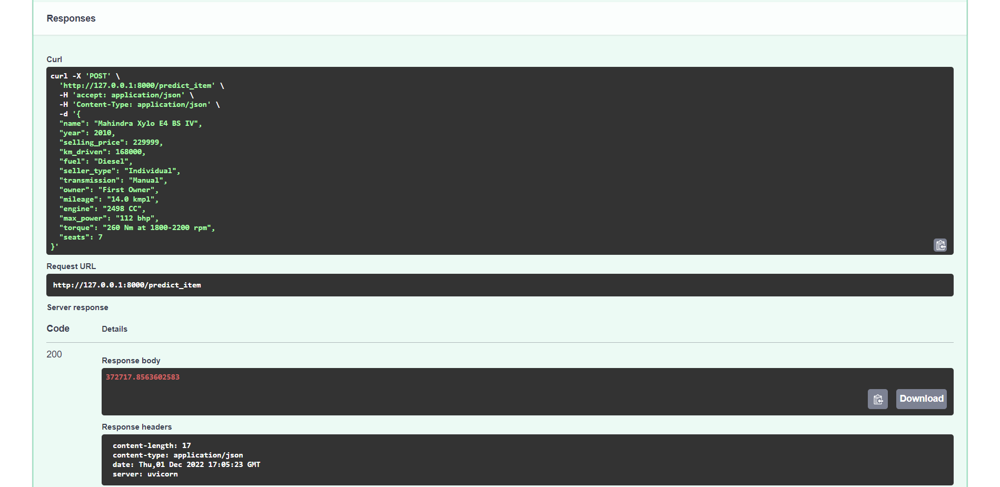
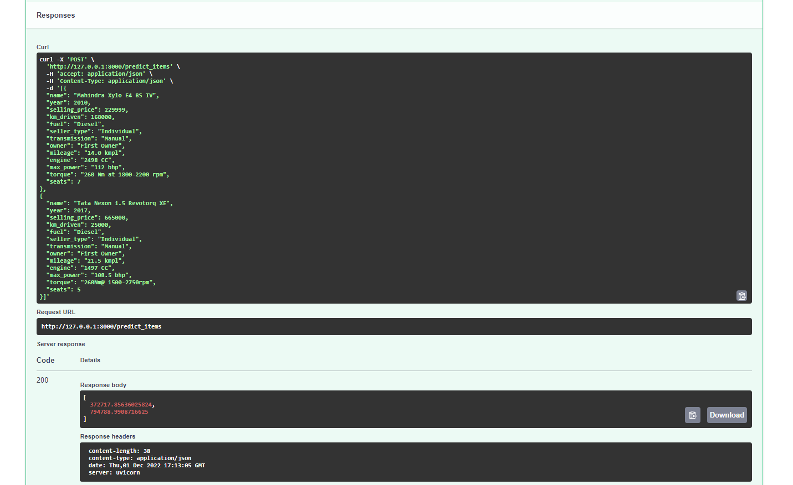

# HSE-Module2-ML-HW1
## Что было сделано
- EDA:
    + Проанализированы основные статистики признаков
    + Удалены дубликаты
    + NA заменены с помощью медиан
    + Ряд численных признаков извлечен из строкового формата с сохранением единых систем измерения
- Визуализация
    + Построены графики попарных распределений
    + Построена тепловая карта попарных корреляций
    + Построены распределения категориальных признаков
    + Построены boxplot-ы для визуализации выбросов
 - Обучение моделей
    + Линейная регрессия на численных признаках
    + Lasso регрессия на численных признаках с использованием GridSearch для определения оптимального гиперпараметра 
    + Elastic Net на численных признаках с использованием GridSearch для определения оптимальных гиперпараметров
    + Ridge регрессия на численных и категориальных признаках и GridSearch для определения оптимального гиперпараметра 
- Feature Engineering
    + Реализован ряд вариантов создания новых / модернизации старых признаков, улучшающих скор
- Сервис на FastAPI
    + Рализован сервис на FastAPI, позволяющий получать прогнозы для одного/нескольких автомобилей 

## Лучшая модель
Лучшей моделью оказалась Ridge регрессия, обученная на численных и категориальных признаках; был ипсользован GridSearch для подбора оптиамльного гиперпараметра регуляризации. Также в признаки были добавлены марка и модель автомоблиля, это дало наиболший прирост качества (R2 = 0.9 на тесте). Все остальные предложенные варианты feature engineering также реальзованы, но не включены в итоговую модель, так как ухудшали качество.

## FastAPI сервис
Реализован сервис на FastAPI, позволяющий получать предикт для одного автомобиля: 
  
или нескольких автомобилей сразу:  

